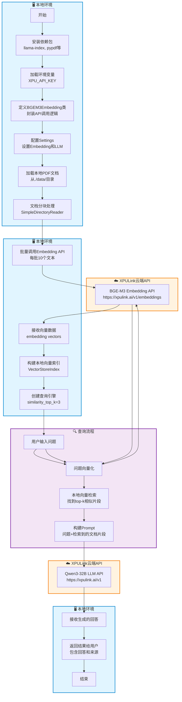
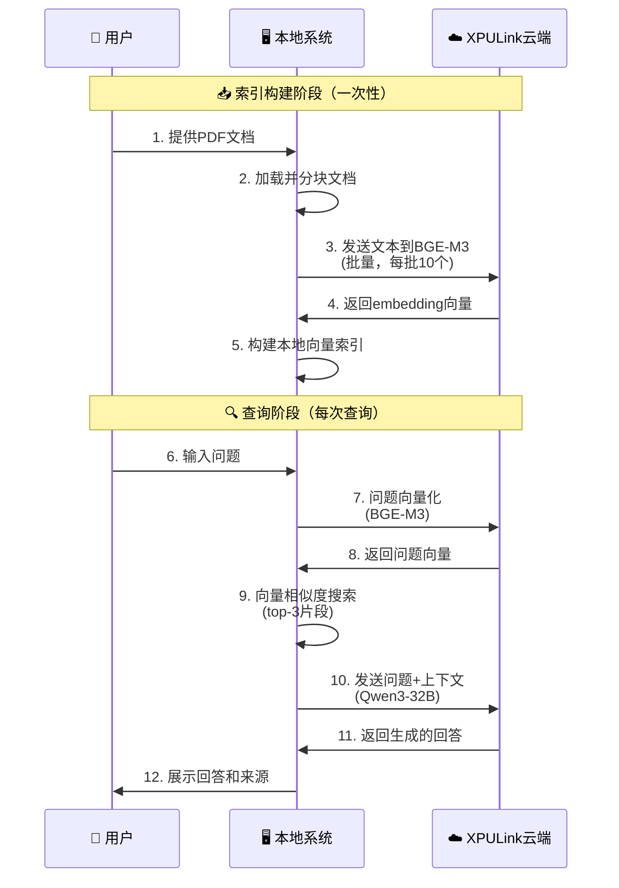

# PDF RAG 系统流程图 - BGE-M3

## 系统架构流程图



## 详细组件说明

### 📍 本地组件
1. **环境配置** - 安装Python依赖包，加载API密钥
2. **PDF加载器** - 从本地`./data/`目录读取PDF文件
3. **文档处理** - 将PDF分块成可处理的文本片段
4. **向量索引** - 在本地内存中存储文档向量和元数据
5. **查询引擎** - 执行向量相似度搜索，管理查询流程

### ☁️ 云端组件（XPULink API）
1. **BGE-M3 Embedding模型**
   - 模型：`bge-m3`
   - 功能：将文本转换为向量（支持中英文）
   - 端点：`https://xpulink.ai/v1/embeddings`
   - 批处理：每批最多10个文本

2. **Qwen3-32B LLM模型**
   - 模型：`qwen3-32b`
   - 功能：根据检索到的上下文生成回答
   - 端点：`https://xpulink.ai/v1`
   - 温度：0.7（控制创造性）

## 数据流向



## 网络通信汇总

| 操作 | 方向 | 端点 | 数据量 | 频率 |
|------|------|------|--------|------|
| 文档向量化 | 本地→云端 | `/embeddings` | 所有文档片段 | 构建索引时一次 |
| 接收文档向量 | 云端→本地 | `/embeddings` | 向量数组 | 构建索引时一次 |
| 问题向量化 | 本地→云端 | `/embeddings` | 单个问题 | 每次查询 |
| 接收问题向量 | 云端→本地 | `/embeddings` | 单个向量 | 每次查询 |
| LLM生成回答 | 本地→云端 | `/v1` (OpenAI格式) | 问题+上下文 | 每次查询 |
| 接收回答 | 云端→本地 | `/v1` (OpenAI格式) | 文本回答 | 每次查询 |

## 关键配置参数

```python
# Embedding配置
- api_base: "https://xpulink.ai/v1"
- model: "bge-m3"
- embed_batch_size: 10  # 本地批处理大小

# LLM配置
- api_base: "https://xpulink.ai/v1"
- model: "qwen3-32b"
- temperature: 0.7

# 查询配置
- similarity_top_k: 3  # 检索最相似的3个片段
- response_mode: "compact"  # 紧凑模式生成回答

# 数据路径
- DATA_DIR: "./data/"  # 本地PDF存储目录
```

## 性能考虑

### 本地处理
- ✅ 向量检索（快速，毫秒级）
- ✅ 文档加载和分块
- ✅ 索引管理

### 云端API调用
- ⏱️ Embedding生成（取决于网络和文档量）
- ⏱️ LLM回答生成（通常2-5秒）
- 💡 建议：索引构建后可保存到本地，避免重复调用

## 成本优化建议

1. **减少Embedding调用**：索引构建后持久化保存
2. **批量处理**：已优化为每批10个文本
3. **缓存查询**：对常见问题缓存回答
4. **控制top_k**：减少检索片段数量可降低token使用
